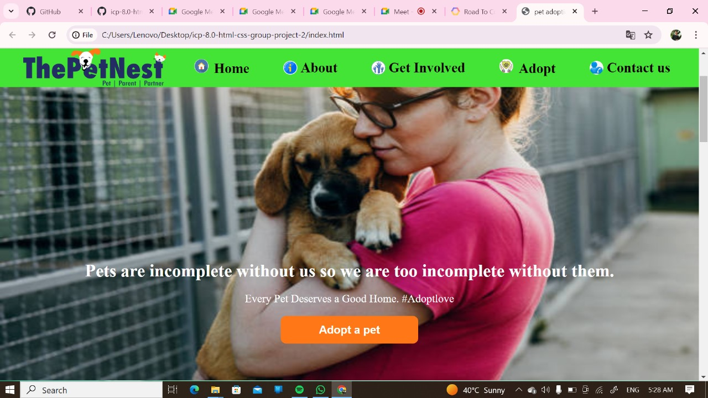

# **ThePetNest Website**
## "Pets are incomplete without us similarly we are too incomplete without them."


## Introduction:

Welcome to ThePetNest website! This README will guide you through the key features and functionalities of our site, helping you understand what we offer and how you can make the most of our platform.

## What It Does?

1. **Pet Adoption**
    - Our website serves as a comprehensive platform where users can find pets available for adoption. We feature a wide variety of cats and dogs looking for loving homes.
    - You can browse through different breeds, ages, and sizes to find the perfect pet that matches your preferences and lifestyle.
    - Each pet profile includes detailed information about the animal, including their history, temperament, and any special needs they might have.

2. **Breed Information**
    - In addition to adoption services, we provide detailed information on different breeds of cats and dogs. This helps potential pet owners understand the characteristics, care requirements, and suitability of various breeds.
    - Our breed information pages include insights on personality traits, grooming needs, exercise requirements, and health considerations.
    - This information is designed to help you make an informed decision about which breed might be the best fit for your home and family.

## How to Use?

1. **Browsing Pets**
    - Visit the "Adopt a Pet" section to start browsing available cats and dogs.
    - Use the filter options to narrow down your search based on species, breed, age, size, and other preferences.
    - Click on a pet's profile to see more details and photos.

2. **Adoption Process**
    - Once you find a pet you’re interested in, click on the "Adopt Me" button on their profile page.
    - Follow the instructions to fill out an adoption application.
    - Our team will review your application and contact you to discuss the next steps, including meeting the pet and completing the adoption process.

3. **Learning About Breeds**
    - Navigate to the "Breeds" section to explore information about different cat and dog breeds.
    - Use the search bar or browse the alphabetical list to find the breed you’re interested in.
    - Read through the detailed breed profile to learn about their traits and care needs.

## Page Descriptions

### Home Page
This page is created by Team Leader **Aditya Kharde.**
The Home Page provides an overview of our mission and features. It welcomes visitors with a brief introduction to ThePetNest and highlights key sections of the site, such as recent adoptions, featured pets, and upcoming events. The Home Page is designed to engage users and encourage them to explore further.

### About Page
This page is created by **Rupesh Mandage**.
The About Page offers detailed information about our organization. It covers our history, mission, and the team behind ThePetNest. This page helps visitors understand our goals, values, and the impact we aim to have on animal welfare. It also includes testimonials and stories from happy adopters.

### Get Involved Page
This page is created by **Vaibhav Sonawane**.
The Get Involved Page provides various ways for visitors to contribute to our cause. This includes information on volunteering opportunities, donation options, and fundraising events. It also highlights other ways to support us, such as fostering pets or spreading awareness through social media.
two 
### Adopt Page
In this page there are three main sections. 
1) Available pet and their details. The dogs details page is created by **Madhumita Sugandhi** & cats details page is created by **Rachana Shivarkar**.
2) Adoption pets choice
which is created by **Aditya Kharde**.
3) Adoption Details
which is created by **Gayatri Lonkar**.
The Adopt Page is the heart of our website, featuring all available pets for adoption. Users can search for pets based on species, breed, age, size, and other criteria. Each pet's profile includes photos, detailed descriptions, and an "Adopt Me" button that guides users through the adoption process.

### Contact Us Page
This page is created by **Lokesh Rajgade**.
The Contact Us Page contains all necessary information for getting in touch with us. This includes our email address, phone number, physical address, and a contact form for inquiries. We also provide links to our social media profiles. This page ensures that visitors can easily reach us for any questions or support.
## *Example Screenshot of Website.*

 
## *Visite to our website.*
[Tap here .](https://the-pet-nest.netlify.app/)

## Technologies Used

Our website is built using the following technologies:

1. **HTML**
    - HTML (HyperText Markup Language) is the standard language for creating web pages. It provides the structure of the website and is used to define elements such as headings, paragraphs, links, images, and more.
    - We use HTML to create a semantic and well-structured layout for our website, ensuring that the content is organized and accessible.

2. **CSS**
    - CSS (Cascading Style Sheets) is used to style and layout web pages. It allows us to apply styles such as colors, fonts, spacing, and positioning to HTML elements.
    - Our website uses CSS to create a visually appealing and user-friendly design. We ensure that our site is responsive, meaning it looks great and functions well on various devices and screen sizes.
  
## Basic code:
``` HTML
<!DOCTYPE html>
<html lang="en">
<head>
    <meta charset="UTF-8">
    <meta name="viewport" content="width=device-width, initial-scale=1.0">
    <title>Dog adoption</title>
</head>
       <style>
        body{
            background-color: #ffffff;
        }
       </style>
<body>
    
</body>
</html>
```
## Contact Us

If you have any questions, need assistance, or want to provide feedback, please don’t hesitate to contact us through the "Contact Us" page on the website. We’re here to help you find your perfect pet match and ensure a smooth adoption experience.

## Contributors
    Aditya Kharde(team leader)
    Madhumita Sugandhi
    Rachana Shivarkar
    Gayatri Lonkar
    Lokesh Rajgade
    Vaibhav Sonawane
    Rupesh Mandage

## Conclusion
Thank you for choosing ThePetNest. We’re dedicated to helping animals find their forever homes and supporting potential pet owners with the information and res~ources they need. Happy pet hunting!
